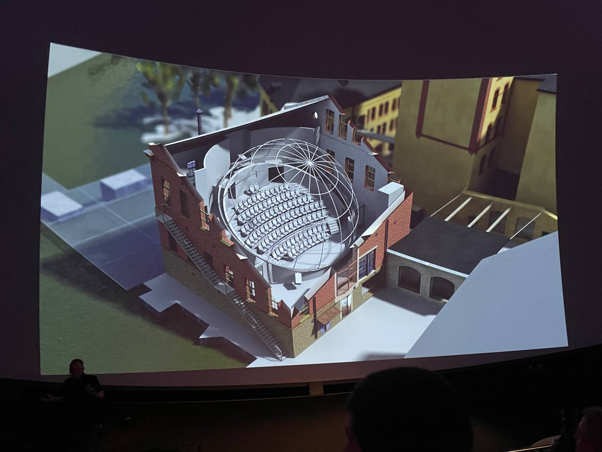
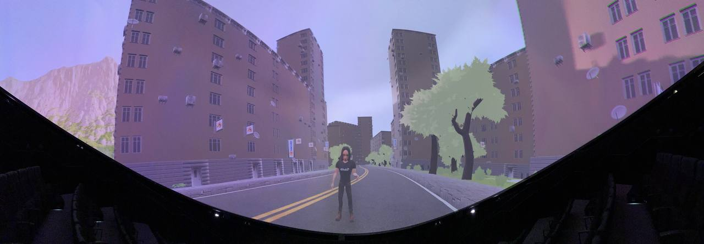
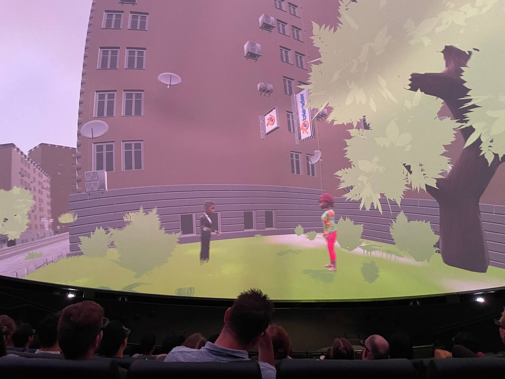
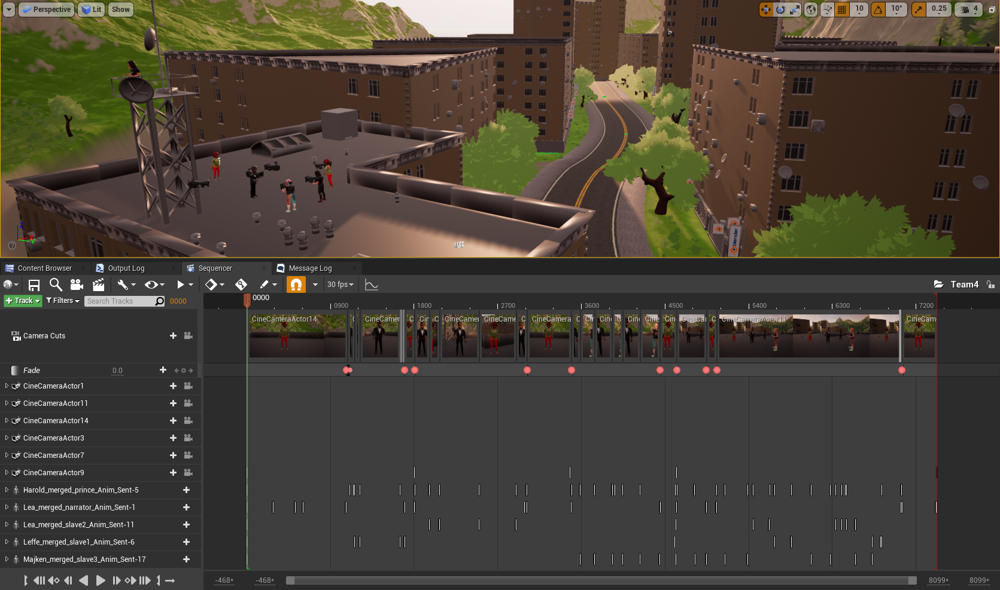

# WASP-3DDomeProject

This project is part of WASP Summer School 2022.

You can also find the original files from [HERE](https://itn-web.it.liu.se/~karlu20/courses/TNM091-2022/).
Old link - [HERE](https://weber.itn.liu.se/~karlu20/courses/TNM091-2022/).
1. Scroll down to "Laboratory Excercises"
2. Go to 4 "Realtime rendering" 
3. Click the "instructions" link
   
To download the files you will need a password. Clone this github repository instead.

To see the full story videos please check [Youtube](https://www.youtube.com/playlist?list=PLIg3Fnk71bdlRUuCPCKDBTjjNYu17zQWu).

# How to run
Download Unreal Engine 4.25.x

Follow the steps from Instructions.pdf

# Tutorial FBX in Unreal Engine
## Tutorial for Visual Studio 2019
1. Download Visual Studio 2019
	1. Select C++ related modules
2. Download Unreal Engine 4.25 version
	1. If you want to write C++ code for it you can also download debug symbols
3. Clone the project with git.
4. Right click the .sln or .uproject file and click generate with unreal engine
	1. If you have multiple versions you can select "choose unreal version"
	This will generate some files that are required to run the project
5. Open Visual Studio 2019 OR double click nDisplayDome.sln
   Hopefully you have everything you need at this point to start it.
6. Run the project
	1. This will open Unreal Editor. Here you can customize your own placements and story

## Unreal Import tutorial
1. Go into the team folder ``Team#/``
2. Upload each animation into the folder (maybe separate)
3. Select the skeleton LaForgeMale or LaForgeFemale
4. Make sure Import Animation is checked
5. Click Import

## Unreal retarget tutorial
1. After "Importing", select the animation file
2. Right-click and select "Retarget Anim Assets"->"Duplicate Anim Asssets and Retarget"
3. Select a target mesh you want to use. There should be an option for each of the characters.
4. Give it a name Prefix or Suffix
5. Select the folder where you want to save the duplicate animation. Preferable somewhere in the team folder.
6. Click retarget button

## Unreal Blueprint tutorial
1. Open Content Browser from Window->Content Browser (below General)
2. Find Tests->BP->SetupTest1
3. Drag this into the scene where you want your recording location to be
4. Use the Transform to rotate the camera around the center
5. Look to the right and select the ``SkeletalMesh`` component
6. Select your mesh

## Unreal Sequence tutorial
